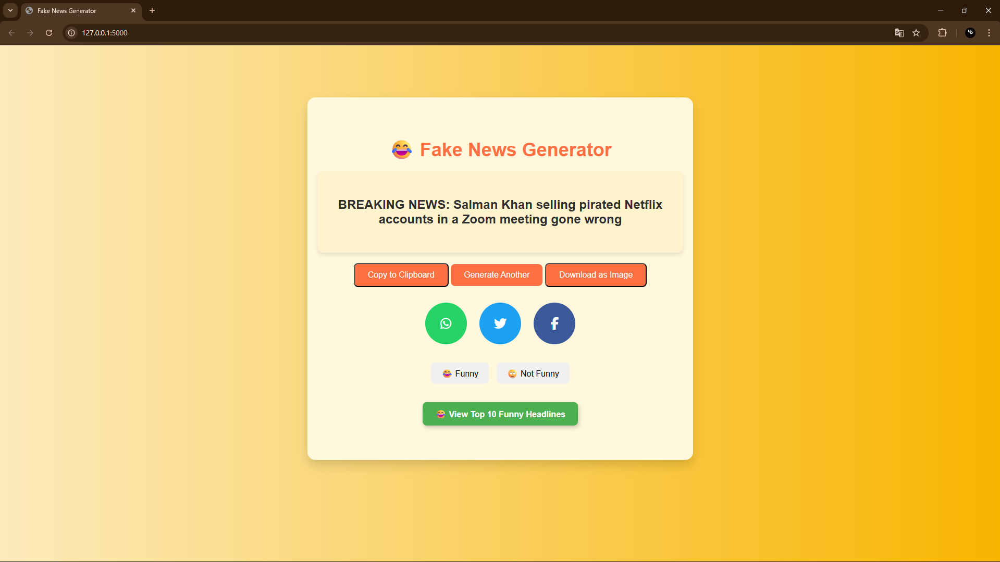

# 📰 Funny News Generator

A Flask-based web app that generates hilarious, fake news headlines for entertainment purposes only.


## ✨ Features
- Generates random funny news headlines
- Lightweight Flask backend
- Simple, responsive web interface
- Instant headline refresh

## 🛠️ Tech Stack
- **Backend:** Python, Flask
- **Frontend:** HTML, CSS (Bootstrap/Tailwind optional)
- **Others:** Randomization logic

## 📸 Demo
  

---
## 😂 Sample Headlines
- "Scientists Confirm Pizza is a Vegetable After All"
- "Dog Elected Mayor, Promises More Parks and Treats"
- "Time Traveler Warns of 2024, But Only Complains About Traffic"
---
## 🚀 Installation & Setup

### 1. Clone the repository
```bash
git clone https://github.com/Uday2306/funny-news-generator.git
cd funny-news-generator
```
### 2. Create a virtual environment (optional but recommended)
```bash
python -m venv venv
```
### 3. Activate the virtual environment
#### Windows (Powershell)

```bash

venv\Scripts\activate
```
#### Mac/Linux

```bash
source venv/bin/activate
```
#### 4. Install dependencies
```bash
pip install -r requirements.txt
```
#### 5. Run the app
```bash
python app.py
Open your browser and go to http://127.0.0.1:5000
```

### 📂 Project Structure
```csharp
funny-news-generator/
│-- static/          # CSS, JS, Images
│-- templates/       # HTML templates
│-- app.py           # Flask app
│-- requirements.txt # Python dependencies
│-- README.md         # Project documentation
```

### 🤝 Contributing
Contributions, issues, and feature requests are welcome!
Feel free to fork this repo and submit a pull request.

### ⚠️ Disclaimer
This app is made for fun and should not be taken seriously.
All headlines are randomly generated and fictional.

### 📜 License
This project is licensed under the MIT License.


---

We can make this even better by adding:  
- A **live demo link** if you host it (Render, Railway, Vercel, etc.)  
- Funny sample headlines  
- Screenshots / GIFs of the app in action  
